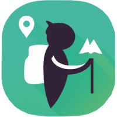
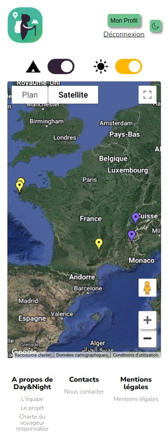
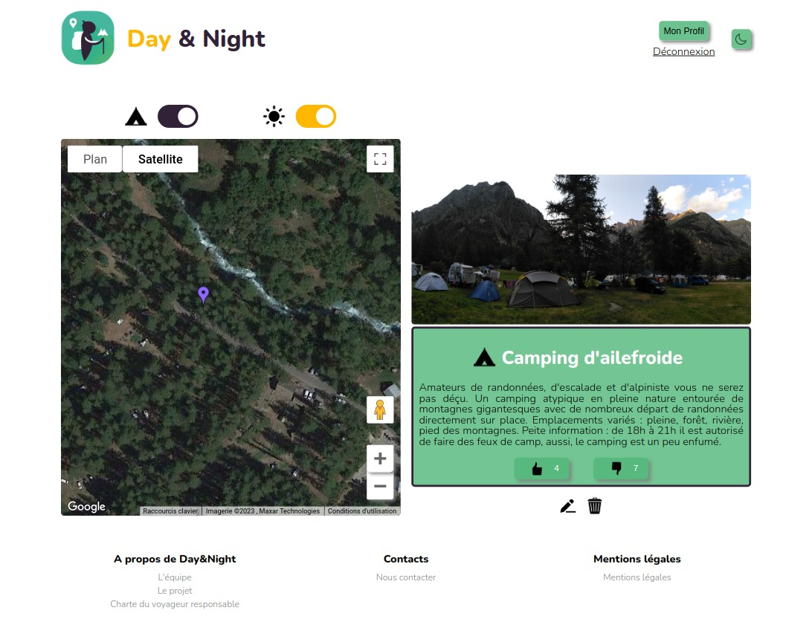

<h1> DAY AND NIGHT</h1>
Créée pour les voyageurs nomades, Day & Night est une application web proposant une carte interactive sur laquelle sont répertoriés des spots où dormir en pleine nature ainsi que des spots à visiter (points de vue, lacs, départs de randonnée, patrimoine...).
Chaque utilisateur a accès aux spots proposés par la communauté.
Les utilisateurs connectés peuvent ajouter des nouveaux spots ou éditer leurs spots, qui seront étudiés puis validés ou non selon les critères définis par les administrateurs.

## Installation locale
* Cloner le projet et se rendre sur le dossier day-and-night
```
git clone https://github.com/O-clock-Lucy/projet-18-day-and-night-front.git
cd day-and-night
```

* Installer les dépendances avec [Yarn](https://classic.yarnpkg.com/lang/en/docs/install/#windows-stable)
```
yarn
```

* Créer un fichier .env à la racine du dossier day-and-night avec les variables ci-dessous :
    * Créer une variable ``REACT_APP_GOOGLEMAP_APIKEY`` contenant votre propre clé API Google Maps (vous pouvez créer une clé API sur [Google Cloud Plateform](https://developers.google.com/maps/premium/apikey/maps-javascript-apikey?hl=fr#creating-api-keys))
    * Créer une variable ``REACT_APP_SYMFO_CONNECT_APIURL`` contenant l'url du serveur backend
    * Vous pouvez vous aider du fichier ``.env.example`` pour créer votre propre fichier ``.env``
```
REACT_APP_GOOGLEMAP_APIKEY = 'votre-clé-API-Google-Maps'
REACT_APP_SYMFO_CONNECT_APIURL = 'http://localhost:8080'
```

* Lancer le serveur frontend avec Yarn  
```
yarn start
```

## Technologies utilisées
* [Design Mobile-First (media-queries)](https://developer.mozilla.org/fr/docs/Web/CSS/Media_Queries/Using_media_queries)
* [Serveur backend homemade](https://github.com/O-clock-Lucy/projet-18-day-and-night-back)
* [Sass](https://sass-lang.com/)
* [React](https://github.com/facebook/react)
* [API Maps Javascript](https://developers.google.com/maps/documentation/javascript?hl=fr)
* [Axios](https://axios-http.com/fr/docs/intro)
* [Redux](https://redux.js.org/)
* [React-Redux](https://react-redux.js.org/)

## Fonctionnalités
#### Les visiteurs doivent être capables de :
* Voir la carte des spots validés
* Filtrer sur les spots DAY ou NIGHT
* Voir les informations d'un spot au clic sur celui-ci
* Créer un compte utilisateur
* Passer l'application en Darkmode


#### Les utilisateurs peuvent EN PLUS :
* Se connecter
* Modifier leurs informations de compte (pseudo, email, mot de passe)
* Créer des spots
* Voir la liste et le status de leurs spots (via leur page Profil)
* Modifier ou supprimer leurs spots (via la Map et leur page Profil)
* Se déconnecter


#### Les administrateurs peuvent EN PLUS :
* Accéder au backoffice
* Voir la liste de tous les spots (peu importe leur status)
* Voir la liste des spots à valider
* Valider, refuser ou supprimer un spot


## Dream Team
[Manon GALLE](https://www.linkedin.com/in/manon-galle/) --> Développeuse Frontend 🌊  
[Albane MAGNIN](https://www.linkedin.com/in/albane-magnin/) --> Développeuse Frontend 🐶  
[Anaïs JOUANNY](https://www.linkedin.com/in/anaisjouanny/) --> Développeuse Frontend ⛺  
[Nicolas RAYNAUD](https://www.linkedin.com/in/raynaudnicolas/) --> Développeur Backend 🎸 

## Screenshots
 
